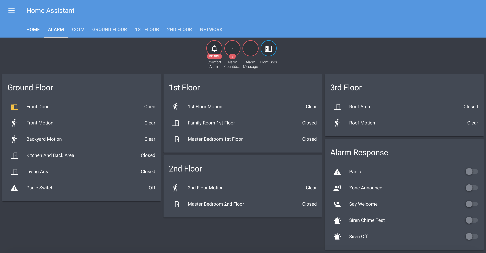
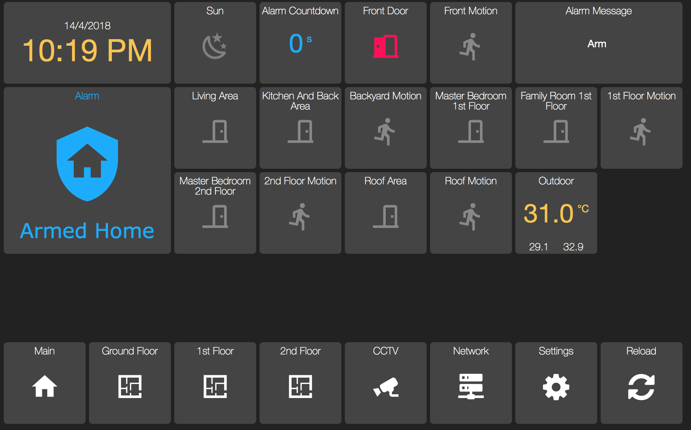

# comfort2

This is a standalone Comfort to MQTT bridge for Cytech's Comfort II Ultra Alarm system with UCM/ETH03 (or ETH02) module primarily intended to integrate with Home Assistant (or OpenHAB or other MQTT compatible systems). It can run on a Raspberry Pi and other systems with Python 3 support.

With Home Assistant, you can further extend the Comfort system with more complex logic, inputs, outputs and actions. Using virtual inputs, you can define additional zones in Comfort triggered by any sensor available in your Home Assistant setup. Or vice-versa, having Comfort trigger any action in your Home Assistant setup.

You should be familiar with configuring Comfort using the Comfigurator tool first. Comfigurator, Comfort manuals and protocol definition available at www.cytech.biz




# Installation

Requires paho-mqtt client. Install using
```
sudo pip3 install paho-mqtt
```
Edit comfort2.py:
```
MQTTBROKERIP = "localhost"
MQTTBROKERPORT = 1883
MQTTUSERNAME = ""
MQTTPASSWORD = ""
COMFORTIP = "192.168.123.88"
COMFORTPORT = 1001
PINCODE = "1234"
```
- set MQTTBROKERIP, MQTTBROKERPORT to your Home Assistant IP address
- set MQTTUSERNAME, MQTTPASSWORD if your Home Assistant MQTT broker requires authentication
- set COMFORTIP, COMFORTPORT to your Comfort ETH02/ETH03 IP address (default ports are 1001,1002)
- set PINCODE to your Comfort PIN code

# MQTT

The following MQTT topics are published:
```
comfort2/alarm - current MQTT alarm state (disarmed, pending, armed_home, armed_away, triggered)
comfort2/alarm/online - 1 for online, 0 for offline
comfort2/alarm/message - informational messages, e.g. the zone that triggered the alarm
comfort2/alarm/timer - countdown entry/exit timer in seconds when arming to away mode or entering. updates every second.

comfort2/input1 - 1 for open/active, 0 for closed/inactive. the state of the zone input. includes virtual input
comfort2/input2
...
comfort2/input96

comfort2/output1 - 1 for on, 0 for off
...
comfort2/output16

comfort2/flag1 - 1 for on, 0 for off
...
comfort2/flag255
```

The following MQTT topics are subscribed:
```
comfort2/alarm/set - sent from Home Assistant, DISARM, ARMED_HOME or ARMED_AWAY

comfort2/input17/set - 1 for open/active, 0 for closed/inactive. virtual input to integrate with any sensor in Home Assistant
...
comfort2/input64/set

comfort2/output1/set - 1 for on, 0 for off. activates the output
...
comfort2/output16/set

comfort2/response1/set - value is ignored. Comfort response is activated as programmed in Comfigurator
...
comfort2/response255/set

comfort2/flag1/set - 1 for on, 0 for off
...
comfort2/flag255/set
```

# Example Home Assistant configuration
> configuration.yaml:
```
alarm_control_panel:
  - platform: mqtt
    name: Comfort Alarm
    state_topic: "comfort2/alarm"
    command_topic: "comfort2/alarm/set"
    availability_topic: "comfort2/alarm/online"
    payload_available: "1"
    payload_not_available: "0"
    code: "1234"  #code can be different from Comfort's
binary_sensor:
  - platform: mqtt
    name: Front Door
    state_topic: "comfort2/input1"
    availability_topic: "comfort2/alarm/online"
    payload_on: "1"
    payload_off: "0"
    payload_available: "1"
    payload_not_available: "0"    
  - platform: mqtt
    name: Front Motion
    state_topic: "comfort2/input8"
    availability_topic: "comfort2/alarm/online"
    payload_on: "1"
    payload_off: "0"
    payload_available: "1"
    payload_not_available: "0"
sensor:
  - platform: mqtt
    name: Alarm Message
    state_topic: "comfort2/alarm/message"
    availability_topic: "comfort2/alarm/online"
    payload_available: "1"
    payload_not_available: "0"
  - platform: mqtt
    name: Alarm Countdown
    unit_of_measurement: "s"
    state_topic: "comfort2/alarm/timer"
    availability_topic: "comfort2/alarm/online"
    payload_available: "1"
    payload_not_available: "0"
    
switch:
#program the response in Comfigurator to make the keypads say 'Welcome Home' first
  - platform: mqtt
    name: Say Welcome 
    state_topic: "comfort2/response16"
    command_topic: "comfort2/response16/set"
    availability_topic: "comfort2/alarm/online"
    payload_on: "1"
    payload_off: "0"
    payload_available: "1"
    payload_not_available: "0"
  - platform: mqtt
    name: Zone Announce
    state_topic: "comfort2/flag16"
    command_topic: "comfort2/flag16/set"
    availability_topic: "comfort2/alarm/online"
    payload_on: "0" #logic is opposite, comfort announces only if flag16 is 0
    payload_off: "1"
    payload_available: "1"
    payload_not_available: "0"
```

Sends notifications to your phone if alarm state changes
> automations.yaml:
```
- action:
    service: notify.notify
    data_template:
      title: '{{ trigger.to_state.attributes.friendly_name }}'
      message: "\n    Armed Home\n\n    Armed Away\n\n    Disarmed\n\n    Pending\n\n    Triggered\n\n    {{ trigger.to_state.state\
        \ }}\n\n"
  id: alarm_state_notification
  alias: Alarm State Notification
  trigger:
    platform: state
    entity_id: alarm_control_panel.comfort_alarm
```
# Running

Make sure nothing else is connected to your Comfort system via ETH02/ETH03 on the specified port.
```
python3 comfort2.py
```
It should automatically connect to both Comfort and Home Assistant. It will hold the connection to Comfort so you cannot use Comfigurator or anything that connects to Comfort. Use Ctrl-C to exit.

# Running as a service

To autostart and run in the background as a systemd service (as pi user), create
```
sudo nano -w /etc/systemd/system/comfort2@pi.service
```
with the following content:
```
[Unit]
Description=Comfort 2
After=network-online.target

[Service]
Type=simple
User=%i
ExecStart=/usr/bin/python3 /home/pi/comfort2/comfort2.py

[Install]
WantedBy=multi-user.target
```

The startup order doesn't really matter as it will auto-connect to your Home Assistant. Then do:

```
sudo systemctl --system daemon-reload
sudo systemctl enable comfort2@pi.service
sudo systemctl start comfort2@pi.service
```

It should then be all working. Subsequently on reboot it will automatically start without having to do anything.
